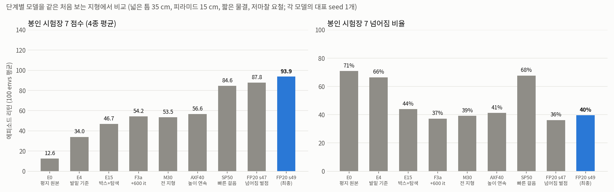
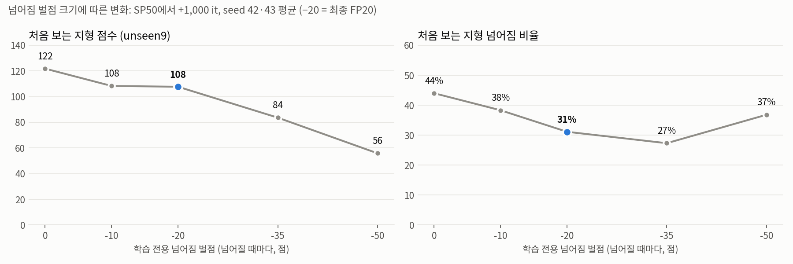

# 처음 보는 지형에서도 걷는 Ant: 평지 원본 → 진단·수정 → 지형 다양화 → 빠른 걸음 → 넘어짐 벌점

로보틱스 시뮬레이션 실습 과제 1(Isaac Lab `Isaac-Ant-v0`, RSL-RL PPO)의 결과 저장소입니다.
평지에서만 걷던 원본 Ant가 **학습 때 보지 못한 지형**에서도 걷도록, 원인을 하나씩 진단하고 환경을 바꿔 가며 학습한 과정을 정리했습니다.

| 구분 | E0 평지 원본 | E4 | E15 / F3a | M30 / AXF40 | SP50 | **FP20 s49 (최종)** |
| --- | --- | --- | --- | --- | --- | --- |
| 핵심 변경 | 원본 그대로 | 발밑 기준 높이 관측·넘어짐 판정, 로봇 마찰 랜덤화 | 박스 전용 + **entropy 0 → 0.005**, 추가 학습 | 평가 지형 11종 전부 섞기, 높이를 타일마다 연속으로, 약한 저마찰 | 우연히 나온 **빠른 걸음**(AXF40 s49)을 이어서 학습 | 학습 때만 **넘어짐 벌점 −20/회** |
| 누적 학습량 | 1,000 it | 1,000 it | 1,000 / 1,600 it | 3,000 / 4,000 it | 5,000 it | 6,000 it |
| 체크포인트 | [e0](docs/assignment1/models/e0_flat_baseline.pt) | [e4](docs/assignment1/models/e4_mixed_relheight_s42.pt) | [e15](docs/assignment1/models/e15_boxes_entropy_s44.pt) / [f3a](docs/assignment1/models/f3a_final_s47.pt) | [m30](docs/assignment1/models/m30_allmix_s47.pt) / [axf40](docs/assignment1/models/axf40_wide_s47.pt) | [sp50](docs/assignment1/models/sp50_fastgait_s47.pt) | [**fp20_final_s49.pt**](docs/assignment1/models/fp20_final_s49.pt) |

모든 모델은 관측 60차원, 행동 8차원(관절 토크), 신경망 [400, 200, 100]이고, 채점에는 **원본 보상 7개 항**을 그대로 씁니다. TA 점수는 우리 환경의 보상으로 계산되므로, 보상을 바꾸면 채점 기준 자체가 바뀌기 때문입니다. 넘어짐 벌점은 학습 때만 더하고 채점용 Play 설정에서는 빠집니다.

## 결과 요약



**봉인 시험장 7**(넓은 틈 35 cm, 높은 피라미드 15 cm, 짧은 물결 12 cm, 저마찰 요철)은 마지막에 만든 처음 보는 지형입니다. 모델 선택에 한 번도 쓰지 않았고, 모든 단계를 한 번에 평가하는 데만 썼습니다.

| 모델 | 봉인 7 점수 | 봉인 7 넘어짐 | 공식 boxes 점수 | 평지 점수 / 속도 / 넘어짐 |
| --- | ---: | ---: | ---: | ---: |
| E0 평지 원본 | 12.6 | 71% | – | 121.8 / 8.1 m/s / 5% |
| E4 | 34.0 | 66% | 39.5 | 64.9 / 4.2 m/s |
| E15 | 46.7 | 44% | 57.1 ± 15.6 | 77.7 / 4.8 m/s |
| F3a | 54.2 | 37% | 61.6 ± 11.8 | 83.2 / 5.2 m/s |
| M30 | 53.5 | 39% | 58.9 ± 15.9 | 91.1 / 6.4 m/s / 17% |
| AXF40 | 56.6 | 41% | 57.1 ± 16.1 | 93.7 / 6.4 m/s / 12% |
| SP50 | 84.6 | 68% | 107.7 ± 40.7 | 120.9 / 12.0 m/s / 59% |
| FP20 s47 | 87.8 | 36% | 117.1 ± 41.7 | 129.0 / 10.8 m/s / 28% |
| **FP20 s49 (최종)** | **93.9** | 40% | **129.3 ± 40.1** | **139.4 / 11.4 m/s / 27%** |

- 점수는 에피소드 리턴입니다(100 envs × 첫 에피소드 평균). 리턴은 대부분 전진 거리에서 나옵니다(1 m ≈ 1점).
- **공식 boxes 점수**는 제출 명령 `play_one_episode.py`(박스 ±10 cm, 100 envs)의 결과이고, 최종 모델은 seed 24로 쟀습니다([EVAL_COMMAND.txt](EVAL_COMMAND.txt)).
- **E0 → 최종:** 처음 보는 지형 점수 7.5배(12.6 → 93.9), 넘어짐 71% → 40%. 평지에서도 원본보다 빠릅니다(8.1 → 11.4 m/s).
- 단계마다 그 단계 전용 봉인 시험장으로 교체를 판정했습니다(봉인 3–6, 8). 표의 봉인 7은 그와 별개로 마지막에 한 번만 쓴 비교용입니다.

## 보행 비교 (SP50 빠른 걸음 vs FP20 최종)

미리보기는 각 영상의 앞 6초입니다. 이미지를 누르면 전체 16초 영상이 열립니다.

| 지형 | SP50 (넘어짐 벌점 없음) | FP20 s49 (최종) |
| --- | --- | --- |
| 박스 ±10 cm | [](experiments/videos_sp50/videos/boxes_mid-step-0.mp4) | [](experiments/videos_final/videos/boxes_mid-step-0.mp4) |
| 계단 10 cm | [](experiments/videos_sp50/videos/stairs-step-0.mp4) | [](experiments/videos_final/videos/stairs-step-0.mp4) |
| 계단 15 cm (봉인 5) | [](experiments/videos_sp50/videos/lock5_stairs_high-step-0.mp4) | [](experiments/videos_final/videos/lock5_stairs_high-step-0.mp4) |
| 평지 | [](experiments/videos_sp50/videos/flat-step-0.mp4) | [](experiments/videos_final/videos/flat-step-0.mp4) |

이전 단계 영상(E0 vs F3a): [docs/assignment1/media](docs/assignment1/media) (`E0_*`, `F3a_*` 미리보기), [experiments/videos/videos](experiments/videos/videos).

## 1. 출발점: E0 평지 원본

수업 명령 그대로 `Isaac-Ant-v0`(평면, 마찰 1.0)를 PPO 1,000 it 학습했습니다. 평지에서는 16초에 약 130 m를 달리지만, 박스 ±10 cm에서는 3.1점(2 m)에 그칩니다. 강의 예시(학습 환경 131.9 → 처음 본 환경 6.5)와 같은 양상입니다.

먼저 평가 환경을 만들고 검증했습니다(`ant_eval_env_cfg.py`). 공식 `play_one_episode.py`와 우리 `evaluate.py`의 점수가 소수점까지 일치하는 것을 확인했습니다.

## 2. 진단과 수정 (E1–E4, E15)

| 진단 | 관찰 | 원인 확인 방법 | 수정 | 효과 |
| --- | --- | --- | --- | --- |
| ① 얼어붙는 개미 | 경사·계단에서 넘어지지 않는데 0 m 전진 | 재학습 없이 **평가 때 높이 관측만 교체** → 0.2 m가 15.6 m로 | 몸통 높이 관측을 **발밑 지면 기준**으로 (ray 1개) | E3 → E4 +6.4 (3 seed) |
| ② 억울한 탈락 | 파인 지형에서 서 있기만 해도 종료 | IsaacLab 주석: 종료 조건이 "평지 전용"(월드 z) | 넘어짐 판정을 **발밑 기준 < 0.31 m**로 | 채점 오류 제거. 평지에서는 원래 규칙과 동일 |
| ③ 학습 정지 | 3000 it로 늘려도 +2점 | TensorBoard: action std 0.02, 학습률이 하한 1e-5에 붙음 | 원본 설정의 **entropy_coef 0 → 0.005** | 박스 전용 위에서 +11.5 (E15) |
| ④ 벌점 588배 누적 | 넘어짐 벌점 실험이 붕괴 | `is_terminated_term`이 읽는 종료 버퍼가 리셋 때 지워지지 않음 | 그 스텝에서 직접 판정하는 `fell_this_step`으로 교체 | 벌점 합이 설계값과 1.02배로 일치. 7단계에서 사용 |

박스 ±10 cm만 연습한 E15가 7종 혼합 지형(E4)보다 모든 지형에서 강했고, 600 it를 더 학습한 F3a가 다음 기준이 되었습니다. 이득은 재시작이 아니라 학습량에서 왔습니다(처음부터 1,600 it 학습한 F3b와 같음). 다만 탐색이 살아 있을 때만 그렇습니다.

## 3. 평가 지형 전부 섞기 (M30) → 높이 연속 + 약한 저마찰 (AXF40)

- **M30:** 평가 지형 11종(박스 3종, 평지, 요철 2종, 경사, 계단, 좁은 박스, 장애물, 물결)을 박스 30%와 나머지 7%씩 섞어 3,000 it 학습했습니다. 이때부터 처음 보는 지형의 기준은 봉인 1·2(레일·틈·구덩이·징검다리·원기둥·원뿔·기울어진 블록·단상)로 바꿨습니다.
  - 봉인 3에서 M30 56.9 vs F3a 46.8 → 교체.
- **AXF40:** 같은 11종을 타일마다 높이 0–1 난이도로 무작위화(박스 3–15 cm 등)하고, 로봇 마찰을 0.4–1.2(multiply)로 넓혀 +1,000 it 학습했습니다.
  - 새 seed 3개 짝 비교 +8.2, 3/3 우세. 봉인 4에서 45.6 vs 44.4 → 교체.
- **포화:** 같은 설정으로 학습만 더 하면 4,000 it 근처에서 멈췄습니다(MF50b +0.1).

## 4. 빠른 걸음의 발견 (SP50)

같은 AXF40 설정에서 **seed 49 하나만** 평지 10.4 m/s로 달리는 걸음을 배웠습니다. 넘어짐은 66%였지만 return이 훨씬 높았습니다(공식 86.9 vs 57.1).
- 원본 보상은 앞으로 간 만큼 주는 항이 크고, 넘어지면 남은 시간의 보상을 못 받는 것이 전부입니다. 그래서 빨리 가다 일찍 넘어지는 쪽이 조심스럽게 16초를 버티는 쪽보다 점수가 높습니다.
- 이 걸음을 +1,000 it 이어서 학습한 **SP50**은 5개 seed 모두 크게 올랐습니다(+25.0, 95% CI −4.3 ~ +54.3).
  - 봉인 5(15 cm 계단, 0.35 경사, 촘촘한 원뿔, 저마찰 박스)에서 78.7 vs 52.4. 15 cm 계단 30 → 93.
  - 공식 점수가 처음으로 100을 넘었습니다(107.7).
- 조심스러운 걸음 계열이 4,000 it에서 포화된 것과 대조적입니다. 학습이 seed에 따라 서로 다른 국소 최적(조심스러운 걸음 / 빠른 걸음)으로 수렴한 것으로 해석합니다.

## 5. 최종: 넘어짐 벌점 (FP20)

SP50은 점수는 높지만 에피소드의 50–60%에서 넘어졌습니다. 학습 보상에만 넘어짐 벌점을 더했습니다.
- 넘어진 스텝에 −20점입니다(`fell_this_step`, weight −1200 × 1/60 s). Play 설정은 이 항을 지우므로 **채점 보상은 그대로**입니다.
- SP50 s{seed}에서 +1,000 it 학습했습니다.

| SP50 → +1,000 it (s42·43 평균, SP50과 짝 비교) | 점수 차이 | 처음 보는 지형 넘어짐 차이 |
| --- | ---: | ---: |
| 벌점 없음 (C60, 대조군) | **+17.0** | −7%p |
| **−20/회 (FP20)** | +2.9 | **−20%p** |
| −50/회 (FP50) | −49.0 (걸음 붕괴) | −14%p |



- **벌점 크기 곡선 (5개 점, s42·43):** −20이 꺾이는 지점입니다.
  - −10과 −20은 점수가 같고(108), −20에서 넘어짐이 더 적습니다(38% → 31%).
  - −35는 넘어짐을 4%p 더 줄이는 대가로 점수를 24점 잃습니다.
  - −50은 걸음이 무너져 넘어짐도 다시 늘어납니다(37%).
- **확인 (새 seed 47–49):** 넘어짐 −27%p(3/3 감소), 점수 +5.5.
- **봉인 6**(내려가는 계단·경사, 거친 요철 15 cm, 기울어진 상자): FP20 98.0(넘어짐 30%) vs SP50 88.2(65%) → 교체.
- **덜 넘어지면 점수도 오릅니다.** 끝까지 버티며 남은 시간의 보상을 받기 때문입니다(공식 에피소드 길이 671 → 874 step, 최대 960).
- **seed 선택:** FP20의 5개 seed 중 검증 지표(봉인 1·2 + 저마찰 박스)가 가장 높은 s49를 고르고, 미사용 봉인 8(높은 상자 18 cm, 내려가는 계단 13 cm, 넓은 징검다리, 저마찰 경사)로 확인했습니다. 93.5 vs 87.0, 넘어짐 34% vs 39% → **최종 FP20 s49.**

## 채택하지 않은 실험

모든 실험은 결과를 보기 전에 통과 기준을 기록하고, seed 2개로 선별한 뒤 **새 seed 3개로 확인**했습니다. 아래 결과는 "해롭다"가 아니라 "이 설정에서 이득의 증거가 없었다"는 뜻입니다.

| 단계 | 실험 | 결과 |
| --- | --- | --- |
| F3a 이전 | 차선 커리큘럼, 관측 history, push·질량 랜덤화, 발 공중 체류 보상, 전방 높이 스캔, 비대칭 critic, 에너지 벌점 | −12 ~ +1.7. 에너지 벌점은 선별 +5.3 → 확인 −1.7(승자의 저주). 전체: [RESULTS.md](docs/assignment1/RESULTS.md) |
| M30 이후 | 큰 신경망 [512, 256, 128] / LSTM 기억 / 강한 저마찰 0.05–1.2 | +0.2 / −3.6 / −4.4 ~ −6.9 |
| | 근사 좌우 대칭 증강 | **−20.2**. Ant 에셋이 정확히 대칭이 아니어서(잔차 0.18) 거울 데이터가 실제 동역학과 맞지 않음 |
| | 중간 저마찰 0.2–1.2 | 점수 −1.6, 저마찰 박스 +20. 저마찰과 다른 지형의 맞바꿈 |
| SP50 이후 | 빠른 걸음 + 마찰 0.2 (SPF20) | 확인 통과, 봉인 5에서 SP50에 짐(76.0 vs 78.7) |
| FP20 이후 | 벌점 유지 + 학습 더 (FPL) / 벌점 −30 (FPU) | −3.9 / −19.4. 넘어짐만 7–8%p 더 줄어듦 |
| | 마찰 0.3 (FPF) / 돌기 높이 1/3 상향 (FPH) / 둘 다 (HF) | +2.3 / 확인 +2.8 (기준 +3) / −7.3 |

## 평가 방법

- **시험장 15조건**(`ant_eval_env_cfg.py`): 연습한 종류 10개 + 처음 보는 종류 5개(좁은 박스, 장애물, 물결, 평지 μ0.1, 박스 μ0.2).
- **봉인 시험장 1–8:** 각각 결과를 보기 전에 확정했습니다.
  - 봉인 1·2는 M30 이후 처음 보는 지형 지표(unseen9 = 봉인 1·2 + 박스 μ0.2 multiply)로 썼습니다.
  - 봉인 3–6, 8은 각 단계의 교체 판정에 한 번씩만 썼습니다.
  - 봉인 7은 마지막 단계별 비교에만 썼습니다.
- **두 단계 확인:** seed 42·43으로 선별하고, 새 seed 47–49로 같은 seed의 부모와 짝지어 확인했습니다. 이 절차로 좋아 보였던 후보가 운이었던 경우를 여러 번 걸러냈습니다(에너지 벌점 +5.3 → −1.7, FPH +4.7 → +2.8).
- **TA 방식 재현:** 제출 Play 설정에 평지와 박스 × 마찰 1.0·0.2 × 결합 average·multiply 8조건을 끼워 실행을 확인했습니다. 공식 명령은 학습 옵션 override 유무와 관계없이 같은 점수를 냅니다.
- 모든 판정 규칙과 결과: [EXPERIMENTS.md](experiments/EXPERIMENTS.md)(E1–F3a), [EXPERIMENTS_overnight_fb.md](experiments/EXPERIMENTS_overnight_fb.md)(배치 5–22).

## 실행

```bash
conda activate lerobot-arena
cd ~/IsaacLab_RS

# 최종 모델 시각화 (Isaac Sim 창, 박스 ±10 cm)
./isaaclab.sh -p scripts/reinforcement_learning/rsl_rl/play.py \
  --task Isaac-Ant-R5-AllMix-Play-v0 --seed 24 --num_envs 16 \
  --checkpoint docs/assignment1/models/fp20_final_s49.pt

# 공식 채점 (100 envs, 첫 에피소드 리턴 평균 ± 표준편차 출력)
./isaaclab.sh -p scripts/reinforcement_learning/rsl_rl/play_one_episode.py \
  --task Isaac-Ant-R5-AllMix-Play-v0 --seed 24 --num_envs 100 \
  --checkpoint docs/assignment1/models/fp20_final_s49.pt

# 특정 지형으로 정량 평가 (headless, JSON 저장)
./isaaclab.sh -p scripts/reinforcement_learning/rsl_rl/evaluate.py \
  --task Isaac-Ant-R5-AllMix-Play-v0 --terrain lock5_stairs_high \
  --checkpoint docs/assignment1/models/fp20_final_s49.pt --output /tmp/fp20_stairs.json

# 영상 녹화 (학습 중에는 --device cpu로 물리를 CPU에서; 학습과 GPU 렌더링을 함께 하면 메모리 부족)
./isaaclab.sh -p scripts/reinforcement_learning/rsl_rl/evaluate.py \
  --task Isaac-Ant-R5-AllMix-Play-v0 --terrain boxes_mid --num_envs 4 --video --headless \
  --checkpoint docs/assignment1/models/fp20_final_s49.pt --output /tmp/fp20_video/boxes_mid.json
```

<details>
<summary>최종 모델 재현 학습 (seed 49 계열, 각 단계 train_finetune.py로 이어서 학습)</summary>

```bash
E=agent.algorithm.entropy_coef=0.005
./isaaclab.sh -p scripts/reinforcement_learning/rsl_rl/train.py --task Isaac-Ant-R5-AllMix-v0 \
  --headless --seed 49 --run_name m30_s49 --max_iterations 3000 $E
./isaaclab.sh -p scripts/reinforcement_learning/rsl_rl/train_finetune.py --task Isaac-Ant-R9-AllMixWideMF04-v0 \
  --headless --seed 49 --run_name axf40_s49 --max_iterations 1000 --init_checkpoint <m30_s49>/model_2999.pt $E
./isaaclab.sh -p scripts/reinforcement_learning/rsl_rl/train_finetune.py --task Isaac-Ant-R9-AllMixWideMF04-v0 \
  --headless --seed 49 --run_name sp50_s49 --max_iterations 1000 --init_checkpoint <axf40_s49>/model_999.pt $E
./isaaclab.sh -p scripts/reinforcement_learning/rsl_rl/train_finetune.py --task Isaac-Ant-R9-AllMixWideMF04FP20-v0 \
  --headless --seed 49 --run_name fp20_s49 --max_iterations 1000 --init_checkpoint <sp50_s49>/model_999.pt $E
```

- 빠른 걸음은 AXF40 단계에서 seed 49에만 나타났습니다. 같은 seed라도 GPU 비결정성 때문에 같은 걸음이 다시 나온다는 보장은 없습니다.
- 실제 최종 모델의 SP50 단계는 axf40_s49에서 seed 49로 이어서 학습한 것입니다(`logs/rsl_rl/ant/*_sp50_s49`, `*_fp20_s49`).

</details>

- 평가 지형 이름: `ant_eval_env_cfg.py`의 `EVAL_TERRAINS`와 `LOCKBOX*_TERRAINS` (예: `boxes_mid`, `stairs`, `ho_obstacles`, `lock_stones`, `lock5_stairs_high`, `lock7_gaps_wide`).

## 코드와 자료

| 자료 | 내용 |
| --- | --- |
| [원본 Ant 설정](source/isaaclab_tasks/isaaclab_tasks/manager_based/classic/ant/ant_env_cfg.py) | 수정하지 않은 출발점 |
| [ant_rough_env_cfg.py](source/isaaclab_tasks/isaaclab_tasks/manager_based/classic/ant/ant_rough_env_cfg.py) | E1–E4: 발밑 기준 높이 관측·넘어짐 판정, 로봇 마찰 랜덤화, Play 설정 |
| [ant_rough2_env_cfg.py](source/isaaclab_tasks/isaaclab_tasks/manager_based/classic/ant/ant_rough2_env_cfg.py) | `Oracle` = E15/F3a 환경과 Play 설정(학습 전용 보상 제거) |
| [ant_rough5_env_cfg.py](source/isaaclab_tasks/isaaclab_tasks/manager_based/classic/ant/ant_rough5_env_cfg.py) | M30(AllMix), AXF40(AllMix-Wide + 저마찰), FP20(넘어짐 벌점) 등 최종 계열 |
| [ant_eval_env_cfg.py](source/isaaclab_tasks/isaaclab_tasks/manager_based/classic/ant/ant_eval_env_cfg.py) | 평가 지형 15조건, 봉인 시험장 1–8 |
| [ant_rough4_env_cfg.py](source/isaaclab_tasks/isaaclab_tasks/manager_based/classic/ant/ant_rough4_env_cfg.py) | `fell_this_step` (버그를 피한 넘어짐 판정 함수) |
| [evaluate.py](scripts/reinforcement_learning/rsl_rl/evaluate.py) · [eval_sweep.sh](scripts/reinforcement_learning/rsl_rl/eval_sweep.sh) · [train_finetune.py](scripts/reinforcement_learning/rsl_rl/train_finetune.py) | 정량 평가, 15조건 일괄 평가, 이어서 학습 |
| [experiments/](experiments) | 실험 기록, 대기열 스크립트(`queue_fb_b*.py`), 평가 JSON, 봉인 결과, 영상 |
| [logs/rsl_rl/ant/](logs/rsl_rl/ant) | run별 설정(`params/`), 코드 diff(`git/`), TensorBoard 로그 |
| [docs/assignment1/](docs/assignment1) | 대표 체크포인트(+SHA256), 그래프와 생성 코드, 미리보기, 결과표, 조사 보고서 |

<details>
<summary>조사 보고서 (검증된 문헌 근거)</summary>

- [미지형 보행 일반화 아이디어](docs/assignment1/research/01_ideas.md)
- [문제별 검증된 해결책](docs/assignment1/research/02_verified_solutions.md)
- [Ant에 방법론을 적용한 논문 목록](docs/assignment1/research/03_ant_papers.md): Ant + 처음 보는 지형 종류를 다룬 동료 평가 논문은 찾지 못함

</details>

## 한계

- **넘어짐:** 처음 보는 지형에서 여전히 24–40%가 넘어집니다. 벌점을 더 키우거나 학습을 더 하면 넘어짐은 조금 줄지만 점수가 떨어졌습니다(FPU, FPL, FP50).
- **점수와 넘어짐의 맞바꿈:** 채점 점수만 보면 벌점 없이 더 학습한 C60이 FP20보다 높았습니다(unseen9 121.8 vs 107.7, s42·43, 넘어짐 44% vs 31%). C60은 확인 단계와 봉인 시험장 평가를 하지 않았습니다. 넘어지지 않게 보완하는 방향을 택해 FP20을 최종으로 했습니다.
- **점수 편차:** 공식 점수의 표준편차가 40으로 큽니다(조심스러운 걸음 F3a는 12). 빠르게 가다 넘어지는 에피소드와 끝까지 가는 에피소드가 섞여 있기 때문입니다.
- **저마찰:** 마찰 결합 multiply + μ0.2 박스에서 18점으로 가장 약합니다. 마찰 범위를 넓혀 연습해도 이 조건은 좋아지지 않았고, 다른 지형 점수와 맞바꿈이 생겼습니다.
- **빠른 걸음은 한 seed에서 나왔습니다.** SP50·FP20의 모든 seed는 axf40_s49 하나에서 이어 학습한 것이라, seed 간 차이는 학습 잡음만 반영합니다. 빠른 걸음이 다른 seed에서도 나오는지는 확인하지 못했습니다.
- **반복 사용한 지표:** 봉인 1·2(unseen9)는 M30 이후 선택에 반복해서 쓰였으므로 검증 지표입니다. 처음 보는 지형 성능의 근거로는 단계마다 한 번만 쓴 봉인 3–8을 보십시오.
- 근거 문헌은 모두 12관절 사족 로봇 연구입니다. Ant + 처음 보는 지형 종류를 다룬 동료 평가 논문은 찾지 못했습니다.

## 참고

[Isaac Lab](https://github.com/isaac-sim/IsaacLab)과 수업 저장소 [cailab-hy/IsaacLab_RS](https://github.com/cailab-hy/IsaacLab_RS) (커밋 `e83a5d2`)의 Ant 태스크, [RSL-RL](https://github.com/leggedrobotics/rsl_rl) 3.0.1을 사용했습니다. 원래 Isaac Lab README는 [docs/README_IsaacLab_original.md](docs/README_IsaacLab_original.md)에 있습니다. 코드는 원 저작권 고지와 [BSD-3-Clause](LICENSE)를 따릅니다.
