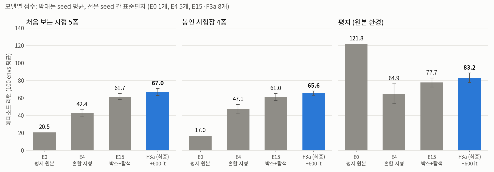
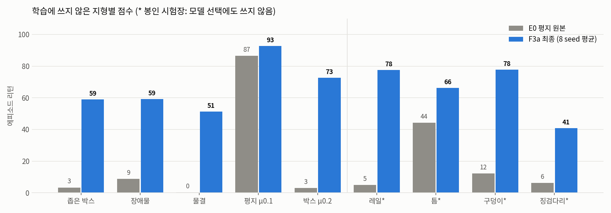

# 처음 보는 지형에서도 걷는 Ant: 평지 원본 → 진단·수정 → 박스 전용 + 탐색 → 추가 학습

로보틱스 시뮬레이션 실습 과제 1(Isaac Lab `Isaac-Ant-v0`, RSL-RL PPO)의 결과 저장소입니다.
평지에서만 걷던 원본 Ant가 **학습 때 보지 못한 지형**에서도 걷도록, 원인을 하나씩 진단하고 환경을 바꿔 가며 학습한 과정을 정리했습니다.

| 구분 | E0 평지 원본 | E4 혼합 지형 | E15 박스 + 탐색 | **F3a 최종** |
| --- | --- | --- | --- | --- |
| 목적 | 기준선 (수업 baseline) | 지형 일반화 첫 단계 | 학습 정지 해결 + 지형 단순화 | 학습량 확대 |
| 학습 지형 | 평면 | 7종 혼합 (평지·박스·요철·경사±·계단±) | 박스 ±10 cm만 | E15와 같음 |
| 핵심 변경 | 원본 그대로 | 발밑 기준 높이 관측·넘어짐 판정, 로봇 마찰 랜덤화, 차선 커리큘럼 | 커리큘럼 제거, **entropy 0 → 0.005** | E15에서 600 it 이어서 학습 |
| 학습량 | 1,000 it | 1,000 it | 1,000 it | 1,000 + 600 it |
| 체크포인트 | [e0_flat_baseline.pt](docs/assignment1/models/e0_flat_baseline.pt) | [e4_mixed_relheight_s42.pt](docs/assignment1/models/e4_mixed_relheight_s42.pt) | [e15_boxes_entropy_s44.pt](docs/assignment1/models/e15_boxes_entropy_s44.pt) | [**f3a_final_s47.pt**](docs/assignment1/models/f3a_final_s47.pt) |

네 모델 모두 관측 60차원, 행동 8차원(관절 토크), 신경망 [400, 200, 100], **원본 보상 7개 항**을 그대로 씁니다. 보상을 바꾸면 채점 기준 자체가 바뀌기 때문입니다(TA 점수는 우리 환경의 보상으로 계산됨).

## 결과 요약



| 모델 | seed 수 | 처음 보는 지형 5종 | 봉인 시험장 4종 | 평지 | 평지 속도 | 처음 보는 지형 넘어짐 |
| --- | ---: | ---: | ---: | ---: | ---: | ---: |
| E0 평지 원본 | 1 | 20.5 | 17.0 | **121.8** | **8.14 m/s** | 68% |
| E4 혼합 지형 | 5 | 42.4 ± 4.1 | 47.1 ± 5.3 | 64.9 ± 11.4 | 4.17 m/s | 40% |
| E15 박스 + 탐색 | 8 | 61.7 ± 3.4 | 61.0 ± 3.9 | 77.7 ± 5.2 | 4.76 m/s | 23% |
| **F3a 최종** | 8 | **67.0 ± 4.1** | **65.6 ± 2.4** | 83.2 ± 5.4 | 5.21 m/s | **20%** |

- 점수는 에피소드 리턴(100 envs × 첫 에피소드 평균, 평가 seed 24)이고, ± 는 학습 seed 간 표준편차입니다. 리턴은 대부분 전진 거리에서 나옵니다(1 m ≈ 1점).
- **공식 채점 스크립트** `play_one_episode.py`(박스 ±10 cm, 100 envs): E4 39.53 → E15 57.11 ± 15.60 → **F3a 61.57 ± 11.75**.
- 같은 seed끼리 짝지은 차이:
  - F3a − E4: **+23.1** [95% CI +15.7, +30.5], 5/5 우세
  - F3a − E15: **+5.3** [95% CI +2.3, +8.2], 8/8 우세
- **봉인 시험장**은 학습에도, 모델 선택에도 쓰지 않은 지형(레일·틈·구덩이·징검다리)입니다. 선택에 쓴 held-out 점수(67.0)와 봉인 점수(65.6)가 비슷하므로, 고르는 과정에서 점수가 부풀려지지 않았습니다.



## 보행 비교 (E0 평지 원본 vs F3a 최종)

미리보기는 각 영상의 앞 6초입니다. 이미지를 누르면 전체 16초 영상이 열립니다.

| 지형 | E0 평지 원본 | F3a 최종 |
| --- | --- | --- |
| 박스 ±10 cm | [](experiments/videos/videos/E0_boxes_mid-step-0.mp4) | [](experiments/videos/videos/FINAL_F3a_boxes_mid-step-0.mp4) |
| 계단 10 cm | [](experiments/videos/videos/E0_stairs-step-0.mp4) | [](experiments/videos/videos/FINAL_F3a_stairs-step-0.mp4) |
| 장애물 (처음 보는 지형) | [](experiments/videos/videos/E0_ho_obstacles-step-0.mp4) | [](experiments/videos/videos/FINAL_F3a_ho_obstacles-step-0.mp4) |
| 평지 | [](experiments/videos/videos/E0_flat-step-0.mp4) | [](experiments/videos/videos/FINAL_F3a_flat-step-0.mp4) |

- **박스:** E0는 2 m 전진하고 83%가 넘어집니다. F3a는 약 64 m 갑니다(8 seed 평균).
- **계단:** E0는 계단 앞에서 멈춰 섭니다(0 m). F3a는 약 28 m 갑니다(8 seed 평균).
- **평지:** F3a는 넘어짐이 적지만(약 9%) E0보다 느립니다(5.2 vs 8.1 m/s). 아래 "한계"를 참고하세요.

중간 모델 영상: [E4](experiments/videos/videos) (`E4_*.mp4`), [E15](experiments/videos/videos) (`R4_E15_*.mp4`).

## 1. 출발점: E0 평지 원본

수업 명령 그대로 `Isaac-Ant-v0`(평면, 마찰 1.0)를 PPO 1,000 it 학습했습니다. 평지에서는 16초에 약 130 m를 달리지만, 박스 ±10 cm에서는 3.1점(2 m)에 그칩니다. 강의 예시(학습 환경 131.9 → 처음 본 환경 6.5)와 같은 양상입니다.

먼저 평가 환경을 만들고 검증했습니다(`ant_eval_env_cfg.py`). 그 위에서 원인을 하나씩 진단했습니다.
- 평가 조건은 연습한 종류 10개와 처음 보는 종류 5개를 합친 15개입니다.
- 공식 `play_one_episode.py`와 우리 `evaluate.py`의 점수가 소수점까지 일치하는 것을 확인했습니다.

## 2. 진단과 수정

| 진단 | 관찰 | 원인 확인 방법 | 수정 | 효과 |
| --- | --- | --- | --- | --- |
| ① 얼어붙는 개미 | 경사·계단에서 넘어지지 않는데 0 m 전진 | 재학습 없이 **평가 때 높이 관측만 교체** → 0.2 m가 15.6 m로 | 몸통 높이 관측을 **발밑 지면 기준**으로 (ray 1개) | E3 → E4 +6.4 (3 seed) |
| ② 억울한 탈락 | 파인 지형에서 서 있기만 해도 종료 | IsaacLab 주석: 종료 조건이 "평지 전용"(월드 z) | 넘어짐 판정을 **발밑 기준 < 0.31 m**로 | 채점 오류 제거. 평지에서는 원래 규칙과 동일, baseline 점수는 오히려 하락 |
| ③ 학습 정지 | 3000 it로 늘려도 +2점 | TensorBoard: action std 0.02, 학습률이 하한 1e-5에 붙음 | 원본 설정의 **entropy_coef 0 → 0.005** | E4 → E6 +3.7 (5 seed). 박스 전용 위에서는 +11.5 |
| ④ 벌점 588배 누적 | 넘어짐 벌점 실험이 붕괴 | 진단: `is_terminated_term`이 읽는 종료 버퍼가 리셋 때 지워지지 않음 | 그 스텝에서 직접 판정하는 함수로 교체 | 수정 후 벌점 합이 설계값과 1.02배로 일치 |

## 3. 박스 전용 + 탐색 (E15)

원래 "박스만 연습하면 박스에서 몇 점까지 나오나"(상한선)를 재려던 검증 실험(V3)이 **오히려 혼합 지형보다 모든 지형에서 강하고 안정적**이었습니다. 5 seed 모두 48.7–52.3점이었고, 넘어짐은 E4의 절반이었습니다. 여기에 ③의 탐색 계수를 더한 것이 E15입니다.

| 같은 1,000 it, 박스 전용 | entropy 0 (V3) | entropy 0.005 (E15) |
| --- | ---: | ---: |
| 처음 보는 지형 (seed 42–46) | 50.7 | **62.2** (5/5 우세, 차이 95% CI +6.2 ~ +16.7) |
| 학습 끝 action std / 학습률 | 0.04–0.07 / ~1e-4 이하 | 0.33–0.42 / 3e-4 이상 |

같은 학습량(1,000 + 600 it, entropy 0.005)에서도 박스 전용(F3a 67.3)이 7종 혼합(E17c 56.8)보다 **+10.5** 높았습니다(seed 42·43).

E15를 학습시키니 아무도 가르치지 않은 **통통 튀는 걸음**이 스스로 나타났습니다. 앞을 볼 수 없는 Ant가 어떤 높이의 턱이든 넘는 방법으로 보입니다(해석). 반면 발을 띄우도록 보상을 직접 준 실험(E14, E16)은 오히려 점수가 떨어졌습니다.

## 4. 최종: 추가 학습 (F3a)

E15 체크포인트에서 600 it를 이어서 학습했습니다(`train_finetune.py`: 가중치만 불러오고 optimizer와 학습률은 새로 시작).

- 처음부터 1,600 it 학습한 F3b(67.0)가 F3a(67.3)와 같으므로, 이득은 재시작이 아니라 **학습량**에서 왔습니다.
- 탐색이 꺼져 있던 E5(3,000 it)는 늘지 않았습니다. **탐색이 살아 있을 때만 추가 학습이 효과를 냅니다.**
- 2,200 it(K1)는 +1.8로 효과가 줄어듭니다.

교체 판정(새 seed 47–49로 E15와 짝지어 비교): 차이 +8.4 [95% CI +3.2, +13.7], 3/3 우세. 봉인 시험장 65.7(기준 52.2 이상), 스모크 테스트 8조건 통과.

> **학습량 주의:** F3a는 다른 비교 모델(1,000 it)보다 학습량이 1.6배입니다. 같은 학습량 비교는 E0–E15에서 했고, F3a/F3b로 학습량 효과를 분리했습니다.

## 채택하지 않은 실험

모든 실험은 결과를 보기 전에 통과 기준을 기록하고, seed 2개로 선별한 뒤 **새 seed 3개로 확인**했습니다. 아래 결과는 "해롭다"가 아니라 "이 설정에서 이득의 증거가 없었다"는 뜻입니다.

| 실험 | 결과 | 비고 |
| --- | --- | --- |
| 차선 커리큘럼 | 3회 모두 효과 없음 | 한 에피소드에 여러 난이도 타일을 이미 지나감(해석) |
| 관측 history 3 / 관측 정규화 / push·질량 랜덤화 / 평지 비중 25% | −4 ~ −9 (seed 1개) | 문헌에서 검증된 형태(긴 history + 추정기 등)가 아님 |
| 발 공중 체류 보상 (0.1 s, 0.5 s 문헌형) | −7.7, −2.7 | 대신 튀는 걸음이 스스로 나타남 |
| 넘어짐 벌점 (버그 수정 후, 점진 도입) | −2.0 | |
| 전방 높이 스캔 (눈) | 단독 −12, 긴 평지 차선과 함께일 때만 속도 상승 | 문헌의 방법은 teacher-student 2단계와 전용 순환망 |
| 비대칭 critic / teacher 전제 점검(T1) | +1.7 / 60.8 vs 61.2 | 특권 정보를 줘도 개선 없음 → 증류 미실시 |
| 학습 전용 에너지 벌점 −0.02 | 선별 +5.3 → 새 seed −1.7 | **승자의 저주** 사례. 평지 속도는 6.0–6.4 m/s로 상승 |
| 저마찰 확장 (multiply, 0.05–1.2) | held-out −2.5 | 대신 multiply 저마찰 박스에서 33 → 68 |
| 박스 높이 다양화 (±3–15 cm) | +2.3 | |

전체 표: [docs/assignment1/RESULTS.md](docs/assignment1/RESULTS.md)

## 평가 방법

- **시험장 15조건**(`ant_eval_env_cfg.py`)
  - 연습한 종류 10개: 평지, 평지 μ0.5, 박스 ±5·±10·±15, 박스 ±10 μ0.5, 요철 2종, 경사, 계단
  - 처음 보는 종류 5개: 좁은 박스, 불연속 장애물, 물결, 평지 μ0.1, 박스 μ0.2
- **봉인 시험장 4종**(레일 8 cm, 틈 0.2 m, 구덩이 0.15 m, 징검다리): 결과를 보기 전(09-30 00:04)에 확정했고, 모델 선택에 쓰지 않았습니다.
- 모든 판정 규칙은 결과보다 먼저 기록했습니다([EXPERIMENTS.md](experiments/EXPERIMENTS.md), [밤샘 기록](experiments/EXPERIMENTS_overnight_fb.md)).
- 선별 seed와 확인 seed를 분리했습니다. 이 절차로 **좋아 보였던 후보 두 개가 운이었음**을 걸러냈습니다(3차 후보 54.2 → 42–47, 에너지 실험 +5.3 → −1.7).
- TA 방식 재현: 제출 Play 설정에 평지와 박스 × 마찰 1.0·0.2 × 마찰 결합 average·multiply 8조건을 끼워 실행을 확인했습니다.

## 실행

```bash
conda activate lerobot-arena
cd ~/IsaacLab_RS

# 최종 모델 시각화 (Isaac Sim 창, 박스 ±10 cm)
./isaaclab.sh -p scripts/reinforcement_learning/rsl_rl/play.py \
  --task Isaac-Ant-R2-Oracle-Play-v0 --seed 24 --num_envs 16 \
  --checkpoint docs/assignment1/models/f3a_final_s47.pt

# 공식 채점 (100 envs, 첫 에피소드 리턴 평균 ± 표준편차 출력)
./isaaclab.sh -p scripts/reinforcement_learning/rsl_rl/play_one_episode.py \
  --task Isaac-Ant-R2-Oracle-Play-v0 --seed 24 --num_envs 100 \
  --checkpoint docs/assignment1/models/f3a_final_s47.pt

# 특정 지형으로 정량 평가 (headless, JSON 저장)
./isaaclab.sh -p scripts/reinforcement_learning/rsl_rl/evaluate.py \
  --task Isaac-Ant-R2-Oracle-Play-v0 --terrain ho_obstacles \
  --checkpoint docs/assignment1/models/f3a_final_s47.pt --output /tmp/f3a_obstacles.json

# 최종 모델 재현 학습: E15(1,000 it) → F3a(+600 it)
./isaaclab.sh -p scripts/reinforcement_learning/rsl_rl/train.py --task Isaac-Ant-R2-Oracle-v0 \
  --headless --seed 47 --run_name e15_s47 agent.algorithm.entropy_coef=0.005
./isaaclab.sh -p scripts/reinforcement_learning/rsl_rl/train_finetune.py --task Isaac-Ant-R2-Oracle-v0 \
  --headless --seed 47 --run_name f3a_s47 --max_iterations 600 \
  --init_checkpoint logs/rsl_rl/ant/<e15_s47 run>/model_999.pt agent.algorithm.entropy_coef=0.005
```

- TA 제출용 평가 명령: [EVAL_COMMAND.txt](EVAL_COMMAND.txt)
- 평가 지형 이름 목록: `flat, boxes_low, boxes_mid, boxes_high, rough_low, rough_high, slope, stairs, ho_boxes_fine, ho_obstacles, ho_wave, lock_rails, lock_gaps, lock_pits, lock_stones`

## 코드와 자료

| 자료 | 내용 |
| --- | --- |
| [원본 Ant 설정](source/isaaclab_tasks/isaaclab_tasks/manager_based/classic/ant/ant_env_cfg.py) | 수정하지 않은 출발점 |
| [ant_rough_env_cfg.py](source/isaaclab_tasks/isaaclab_tasks/manager_based/classic/ant/ant_rough_env_cfg.py) | E1–E4: 혼합 지형, 차선 커리큘럼, 발밑 기준 높이 관측·넘어짐 판정, 로봇 마찰 랜덤화, Play 설정 |
| [ant_rough2_env_cfg.py](source/isaaclab_tasks/isaaclab_tasks/manager_based/classic/ant/ant_rough2_env_cfg.py) | 2차 플래그 조합. **`Oracle` = 박스 전용(최종 모델 환경)** |
| ant_rough3/4/5_env_cfg.py | 3차(눈·긴 평지), 4차(air-time·벌점·비대칭 critic·push·teacher), 5차(전 지형 혼합, 준비만 함) |
| [ant_eval_env_cfg.py](source/isaaclab_tasks/isaaclab_tasks/manager_based/classic/ant/ant_eval_env_cfg.py) | 평가 지형 15조건, 봉인 시험장 1·2 |
| [evaluate.py](scripts/reinforcement_learning/rsl_rl/evaluate.py) · [eval_sweep.sh](scripts/reinforcement_learning/rsl_rl/eval_sweep.sh) · [train_finetune.py](scripts/reinforcement_learning/rsl_rl/train_finetune.py) | 정량 평가, 15조건 일괄 평가, 이어서 학습 |
| [experiments/](experiments) | 실험 기록, 대기열 스크립트, 평가 JSON, 봉인 결과, 영상 |
| [logs/rsl_rl/ant/](logs/rsl_rl/ant) | 모든 run의 설정(`params/`), 코드 diff(`git/`), TensorBoard 로그. 체크포인트는 README에 쓴 run의 마지막 것만 포함 |
| [docs/assignment1/](docs/assignment1) | 대표 체크포인트(+SHA256), 그래프와 생성 코드, 미리보기, 결과표, 조사 보고서 |

<details>
<summary>조사 보고서 (검증된 문헌 근거)</summary>

- [미지형 보행 일반화 아이디어](docs/assignment1/research/01_ideas.md)
- [문제별 검증된 해결책](docs/assignment1/research/02_verified_solutions.md): 속도-강건성 맞바꿈, fall 감소, 적은 seed 통계, 학습 레시피
- [Ant에 방법론을 적용한 논문 목록](docs/assignment1/research/03_ant_papers.md): Ant + 처음 보는 지형 종류를 다룬 동료 평가 논문은 찾지 못함

</details>

## 한계

- **평지 속도:** 원본의 약 64%(5.2 vs 8.1 m/s)입니다. 앞을 보지 못하는 보행 정책에서 알려진 속도-강건성 맞바꿈과 같은 양상입니다(Margolis 2022, Miki 2022. 단, 12관절 로봇 결과).
- **약한 조건:** 박스 ±15 cm(넘어짐 51%), 마찰 결합 multiply + μ0.2 박스(37.3), 징검다리(약 40)
- 근거 문헌은 모두 12관절 사족 로봇 연구입니다. Ant + 처음 보는 지형 종류를 다룬 동료 평가 논문은 찾지 못했습니다.
- 봉인 시험장은 F3a 교체 판정에 한 번 쓰였고, 이후 seed 전체 평가는 선택이 끝난 뒤의 사후 평가입니다.

## 참고

[Isaac Lab](https://github.com/isaac-sim/IsaacLab)과 수업 저장소 [cailab-hy/IsaacLab_RS](https://github.com/cailab-hy/IsaacLab_RS) (커밋 `e83a5d2`)의 Ant 태스크, [RSL-RL](https://github.com/leggedrobotics/rsl_rl) 3.0.1을 사용했습니다. 원래 Isaac Lab README는 [docs/README_IsaacLab_original.md](docs/README_IsaacLab_original.md)에 있습니다. 코드는 원 저작권 고지와 [BSD-3-Clause](LICENSE)를 따릅니다.
